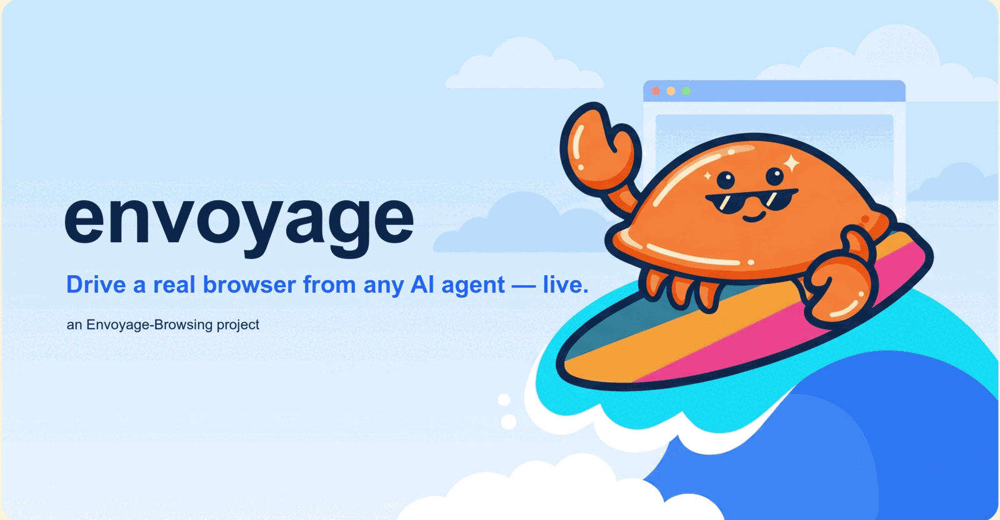

<p align="center">
  
</p>

<p align="center">
  <strong>Drive a real browser from any AI agent — live.</strong><br>
  A headless Chromium over a private CDP pipe, a small ref-based tool surface, and a
  <em>mascot-neutral</em> live screencast — <strong>bring your own mascot</strong>.
</p>

<p align="center">
  <a href="https://github.com/Envoyage-Browsing/envoyage/actions/workflows/ci.yml"></a>
  <a href="https://www.npmjs.com/package/@envoyage/browser"></a>
  <a href="https://www.npmjs.com/package/@envoyage/cli"></a>
  <a href="#license"></a>
  
  <a href="./CONTRIBUTING.md"></a>
  <a href="https://github.com/Envoyage-Browsing/envoyage/commits/main"></a>
</p>

<p align="center">
  <a href="#quickstart"><b>Quickstart</b></a> ·
  <a href="#the-tool-surface"><b>Tool surface</b></a> ·
  <a href="#bounded-website-crawling"><b>Crawling</b></a> ·
  <a href="#human-handoff-passwords-never-reach-the-model"><b>Human handoff</b></a> ·
  <a href="#consumers"><b>Consumers</b></a> ·
  <a href="#configuration"><b>Configuration</b></a> ·
  <a href="#releasing"><b>Releasing</b></a>
</p>

---

envoyage launches a headless Chromium over a private CDP pipe and gives an AI
agent a small, ref-based tool surface to navigate, read, click, type, scroll,
upload, switch tabs, and hand off to a human. It streams a live screencast plus
a **mascot-neutral** cursor/narration protocol so a UI can render its own
animated cursor gliding to exactly where the agent is about to act.

envoyage draws **nothing** itself. It gives you the frame, the cursor point, and
the intent string — you skin them.

## Bring your own mascot

This is the whole point. envoyage emits *what happened* and *what's about to
happen* as vendor-neutral events. The consumer renders them however it likes:

| Consumer | Mascot it glides to the cursor point |
|----------|--------------------------------------|
| ImmorTerm | **Mort** the axolotl |
| ringtail | **Rocco** the ringtail |
| _yours_ | _whatever you draw_ |

envoyage ships no cursor sprite, no balloon, no branding. See
[`src/protocol.rs`](src/protocol.rs) — the customization seam.

## Quickstart

### As a CLI (npm)

```bash
npx @envoyage/cli serve            # MCP over stdio (point Claude / any MCP client at it)
npx @envoyage/cli serve --ws-port 8787   # also stream frames over WS
npx @envoyage/cli serve --ws-port 8787 --mcp   # both
```

### As a Rust crate

```rust
use envoyage::BrowserSession;

let rt = tokio::runtime::Builder::new_current_thread().build()?;
let mut b = BrowserSession::launch(&rt, "https://example.com")?;
let (title, url, nodes) = b.snapshot(true)?;      // ref-based AX listing
b.click_ref("ref_3")?;                            // click by handle
let png_base64 = b.screenshot()?;                 // CSS-pixel-accurate PNG
```

The protocol types a consumer renders:

```rust
use envoyage::{Frame, Cursor, CursorAction, Narration, HumanRequest, Input};
```

## The tool surface

Exposed over MCP (JSON-RPC 2.0) as `browser_*`. Schemas + semantics mirror
ImmorTerm's set, so a model that knows one knows both.

| Tool | What it does |
|------|--------------|
| `browser_open` | Open/reuse the browser and navigate. Returns caption + PNG. |
| `browser_read_page` | AX listing of the page as `[ref_N] role "name"` handles. |
| `browser_find` | Ranked search for elements, same ref shape. |
| `browser_click` | Click by `ref` (preferred) or `x`/`y`. |
| `browser_form_input` | Set a field/checkbox/dropdown by `ref`. |
| `browser_key` | Press Enter/Tab/Escape/Backspace/Arrow*. |
| `browser_scroll` | Scroll by `dy` CSS pixels. |
| `browser_screenshot` | Fresh CSS-pixel-accurate PNG. |
| `browser_tabs_list` / `browser_tabs_switch` | Multi-tab / popup handling. |
| `browser_upload` | Attach a local file to a file input by `ref`. |
| `browser_console` / `browser_network` | Recent console + network entries. |
| `browser_wait_for` | Wait for a selector and/or text (no blind sleeps). |
| `browser_request_human` / `browser_wait_for_human` | Hand off + wait. |
| `browser_gif` | Record a session and export an annotated animated GIF. Parity with claude-in-chrome's `gif_creator`. |
| `browser_close` | Kill the exact spawned browser process. |
| `browser_eval` | **Gated** raw JS — only with `ENVOYAGE_BROWSER_EVAL=1`. |

Page content (listings, tabs, console, network) is framed as **untrusted** —
data, not instructions.

## Bounded website crawling

`envoyage serve` also exposes a provider-neutral crawler for public website
inventory. Start/read/cancel are available through REST, Streamable HTTP MCP
and `@envoyage/browser`. Page sections, links and ordered media are normalized;
provider job IDs and pagination URLs stay private. Media bytes are downloaded
through a job-scoped, host-checked and byte-limited route.

Public Shopify collection URLs are recognized by the built-in verified
adapter. It preserves every Product boundary, handle, canonical URL, gallery
position and original image dimensions without requiring Firecrawl. A generic
provider remains available for other sites and rendered page context.

See [the crawling guide](docs/crawling.md) for configuration, examples, limits
and the security model.

### Human handoff (passwords never reach the model)

When envoyage detects a Cloudflare/CAPTCHA bot-check, an OAuth/sign-in screen, or
a password/one-time-code field — or the agent calls `browser_request_human` —
it **pauses**, sends a `browser_human_request` to the WS UI, and returns
**text only** to the model (no screenshot). While paused the WS still streams
the live view to the human, who solves it and clicks Continue.

### Recording GIFs (`browser_gif`)

`browser_gif` mirrors claude-in-chrome's `gif_creator`, so a model that knows
one already knows this. Flow:

1. `browser_gif { action: "start_recording" }` — buffers the live screencast.
2. Drive the browser with the other `browser_*` tools.
3. `browser_gif { action: "stop_recording" }` — stops buffering, keeps frames.
4. `browser_gif { action: "export", filename?, options? }` — composites overlays,
   writes the GIF to `${ENVOYAGE_HOME:-~/.envoyage}/gif/<filename>`, and returns the
   path. The consumer serves or downloads that file.
5. `browser_gif { action: "clear" }` — drops the buffer.

`options` (export only) mirror `gif_creator`: `showClickIndicators`,
`showActionLabels`, `showProgressBar`, `showDragPaths`, `showWatermark`,
`watermarkText`, `quality` (1–30, lower = better). All bool overlays default
**true** except — envoyage is **vendor-neutral** — `showWatermark` (default
**false**) and `showDragPaths` (not yet implemented). There is **no baked-in
logo**: a watermark renders only your own `watermarkText`. The buffer is capped
(~600 frames); a truncation is logged, never silent.

## The WS protocol

On `--ws-port`, envoyage serves JSON events to every connected client and accepts
input back. Envelope `type` tags and field names:

| Direction | `type` | Payload |
|-----------|--------|---------|
| → client | `browser_frame` | `png_base64`, `title`, `url`, `seq` |
| → client | `browser_cursor` | `x`, `y`, `action` (`move`/`click`/`type`/`scroll`) |
| → client | `browser_narration` | `text` |
| → client | `browser_human_request` | `reason`, `instructions?` |
| → client | `browser_state` | `paused` |
| ← client | `{kind: "click", x, y}` | click on the live view (page CSS px) |
| ← client | `{kind: "key", key}` | a key |
| ← client | `{kind: "scroll", dy}` | wheel scroll |
| ← client | `{kind: "control", action}` | `pause` / `continue` |

Coordinates are **page CSS pixels**. The consumer un-letterboxes its rendered
view to page space before sending clicks.

## Consumers

Embedding envoyage in a TypeScript product — spawn it as an MCP server for your
agent, stream its frames into your UI, and glide *your* mascot to the agent's
cursor:

- **[Consuming Envoyage](docs/consumers/README.md)** — the two surfaces (MCP
  stdio + WS live view), the mascot-neutral protocol, the tool table, and the
  page↔display coordinate mapping.
- **[Envoyage in ringtail](docs/consumers/ringtail.md)** — a ringtail-specific
  walkthrough: MCP SDK + Vercel AI SDK (Gemini) wiring, rendering frames in the
  cockpit, gliding **Rocco**, and the human-handoff UX.
- **[`examples/ringtail-consumer/`](examples/ringtail-consumer/)** — a small
  runnable example: a `driver.ts` that drives the browser over MCP and a
  `viewer.ts` that renders frames + a placeholder Rocco cursor.

## Configuration

| Env | Default | Purpose |
|-----|---------|---------|
| `ENVOYAGE_HOME` | `~/.envoyage` | Base dir for `browser.lock` + the persistent browser profile. |
| `ENVOYAGE_BROWSER_BIN` | auto-detect | Path to a Chromium/Chrome/Brave/Edge binary. |
| `ENVOYAGE_BROWSER_MEMORY_LIMIT_MB` | `4096` | Maximum combined RSS for the local Chromium process group. Envoyage closes only its own browser group when the limit is crossed. Values are clamped to 256–131072 MiB. Remote browsers are not measured locally. |
| `ENVOYAGE_BROWSER_EVAL` | unset | Set to `1` to expose the gated `browser_eval` tool. |
| `ENVOYAGE_MASK_ALL_INPUTS` | unset | `1`/`true` → mask **every** input/textarea/select value in the `read_page`/`find` AX listing (value withheld, `masked:true`). `<input type="password">` is always masked regardless. |
| `ENVOYAGE_MASK_SELECTOR` | unset | CSS selector; any field matching it (or a descendant of a match) has its AX value masked. A bad selector is ignored, never throws. Also always-honored: mark a field or ancestor with the `[data-envoyage-mask]` attribute to mask it. |
| `ENVOYAGE_CRAWL_PROVIDER_URL` | unset | Base URL of the configured Firecrawl v2 engine. Crawling stays unavailable when unset. |
| `ENVOYAGE_CRAWL_PROVIDER_TOKEN` | unset | Optional server-only crawl provider bearer token. |
| `ENVOYAGE_CRAWL_STATE_DIR` | `${ENVOYAGE_HOME}/crawls` | Durable crawl receipts, media manifests and bounded cached raster bytes. |
| `ENVOYAGE_GITHUB_REPO` | `Envoyage-Browsing/envoyage` | Release source for the npm wrapper. |

Only one real browser drives the shared profile at a time — a cross-process
lock (`$ENVOYAGE_HOME/browser.lock`) makes the first `serve` the owner; a later
one that finds a live owner refuses rather than corrupting the profile.

Local browser memory is bounded twice: Envoyage retains at most two pending
screencast frames and eight queued live-view events, and a watchdog measures
the combined RSS of the exact Chromium process group Envoyage spawned. If that
group crosses the configured limit, Envoyage terminates that group. It never
signals another Chrome, Brave, Edge, or Code process.

## Status / not-yet

Solid:
- CDP transport over a private pipe, navigate/click/key/type/scroll.
- Ref-based AX listing (`read_page`/`find`), click/form-input by ref.
- `Page.startScreencast` → live frame stream (WS) at ~15fps with coalescing.
- Human-handoff detection (Cloudflare/CAPTCHA/OAuth/password) + frame
  suppression to the model while paused.
- Multi-tab / popup follow, console + network capture, file upload, wait-for.
- Provider-neutral bounded crawling with REST/MCP/SDK control and exact media downloads.
- One-browser-per-user ownership lock.

Not yet:
- **Cross-process routing.** The lock *detects* a live foreign owner and
  refuses; it does not yet route a tool call to the owner's WS and mirror the
  result. A non-owner gets a clear error. (See `src/browser_lock.rs`.)
- **Windows.** POSIX only (the CDP pipe + process control use `nix`).
- **darwin-x64.** The release matrix ships macOS **arm64** + Linux
  x86_64/aarch64; build from source for Intel Mac.
- The live screencast smoke test (`screencast_live_smoke`) is `#[ignore]`d —
  it needs a real browser + network. Run it explicitly:
  `cargo test -- --ignored screencast --test-threads=1`.

## Releasing

Two npm publish lanes, **both tokenless** via [npm Trusted Publishing](https://docs.npmjs.com/trusted-publishers) (GitHub Actions OIDC + provenance — no `NPM_TOKEN` secret ever):

| What | Package(s) | Workflow | Trigger |
|------|-----------|----------|---------|
| **SDK** | `@envoyage/browser` (`sdk/`) | `.github/workflows/publish-sdk.yml` | push a `sdk-v*` tag |
| **CLI** | `@envoyage/cli` + `@envoyage/cli-{darwin-arm64,linux-x64,linux-arm64}` | `.github/workflows/release.yml` | manual (`workflow_dispatch`) |

### Cut an SDK release

```bash
# 1. bump the version in sdk/package.json (e.g. 0.1.1 → 0.1.2)
# 2. commit it, then tag + push:
git commit -am "release(sdk): @envoyage/browser 0.1.2"
git tag sdk-v0.1.2 && git push origin main sdk-v0.1.2
```

The tag fires `publish-sdk.yml`, which **guards that the tag matches
`sdk/package.json`** (a mismatch fails the run), builds, and publishes with
provenance. Verify: `npm view @envoyage/browser version`.

### Cut a CLI release

Bump `version` in the workspace `Cargo.toml` (or pass a `version` input), then:

```bash
gh workflow run release.yml -f version=0.1.1   # omit -f to use Cargo.toml
```

It builds the native binary for macOS arm64 + Linux x86_64/aarch64, ships each
**as** its platform npm package (so `npm install` never touches GitHub Releases —
works even while the repo is private), publishes the meta package, and cuts a
GitHub Release.

### First publish of a NEW package (one-time bootstrap)

npm's Trusted Publisher config lives on a package's settings page, which
**requires the package to already exist**. So each brand-new package name needs
**one** credentialed first publish, after which it's tokenless forever:

1. Bootstrap-publish once (a maintainer with an npm **Classic → Automation**
   token, which bypasses 2FA — see [CONTRIBUTING.md](CONTRIBUTING.md) for the
   exact one-liner). This creates the package.
2. On npmjs.com → the package → **Settings → Trusted Publisher → GitHub
   Actions**: org `Envoyage-Browsing`, repo `envoyage`, workflow file
   (`publish-sdk.yml` for the SDK, `release.yml` for the CLI). Save.
3. Every publish after that is tokenless CI — no token, no OTP.

Gotchas that will bite you (all real, all learned here): scoped packages
default to **private** — needs `publishConfig.access: public`; plain
`npm publish` **ignores `NODE_AUTH_TOKEN`** locally (npm reads auth from
`.npmrc` `_authToken`); a **granular** token scoped to "select packages"
**cannot create a new package**; and `dist/` is gitignored, so a `prepack`
build must regenerate it at pack time. Full runbook in
[CONTRIBUTING.md](CONTRIBUTING.md).

## License

MIT OR Apache-2.0.
